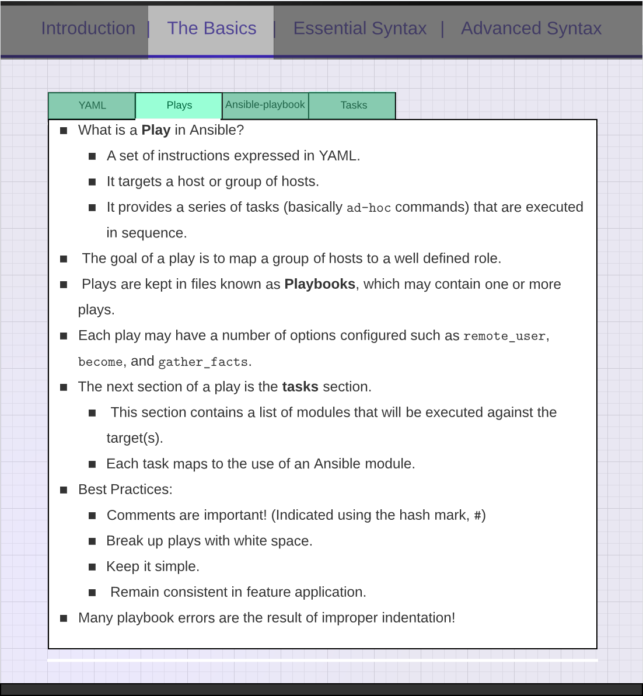

### Ansible Plays



```yml
--- #Play Example
- hosts: localhost
  become: yes # Become root
  tasks: #Doesnt have to be a single task
    - name: install software # a name for the task
      yum: # Module name is normally next
        name: elinks # The name of the repo
        state: latest # The version
    - name: install git
      yum:
        name: git
        state: latest
```
