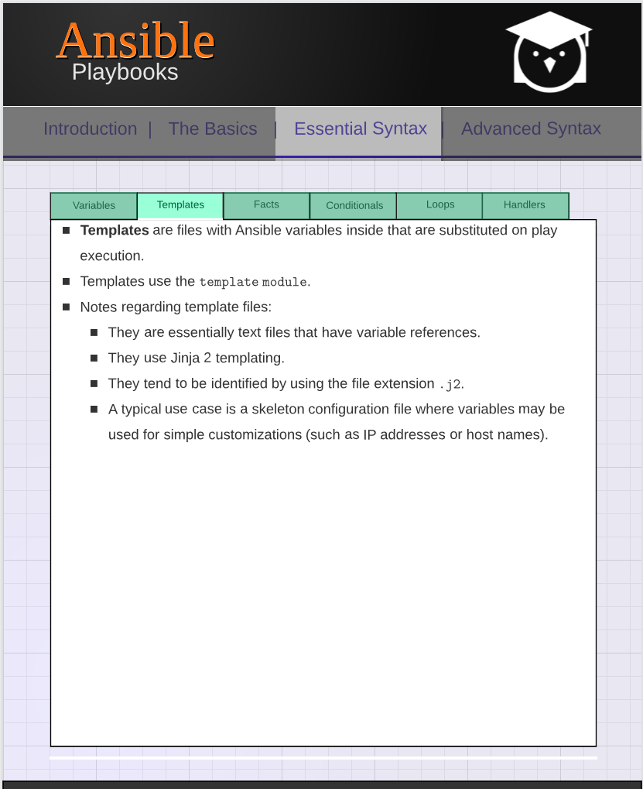

### Ansible Templates



Below is a typical example of using a template file, which normally has a .j2 as the extension

```yml
name={{ code_name }} #As you can see, we have some basic ansible variables being used here
version={{ version }}
```

Now lets say we want to now deploy that file, using a playbook, and populate those variables, within the playbook

```yml
--- #template example
- hosts: localhost
  become: yes
  vars:
    code_name: whisky
    version: 4.2
  tasks:
    - name: deploy config file
      template:
        src: config.j2
        dest: /opt/config
```

The template module will take the source file, which is config.j2 as shown above, and then will take the vars applied in the playbook, and then deploy that file with populating the placeholders with the vars in the playbook, and put it in the destination.

Validate - Template argument which runs a validation command against the resulting file that it creates, the command is passed securely so shell features like expansion and pipes won't work. If the command fails for validation, ansible will fail the task.
